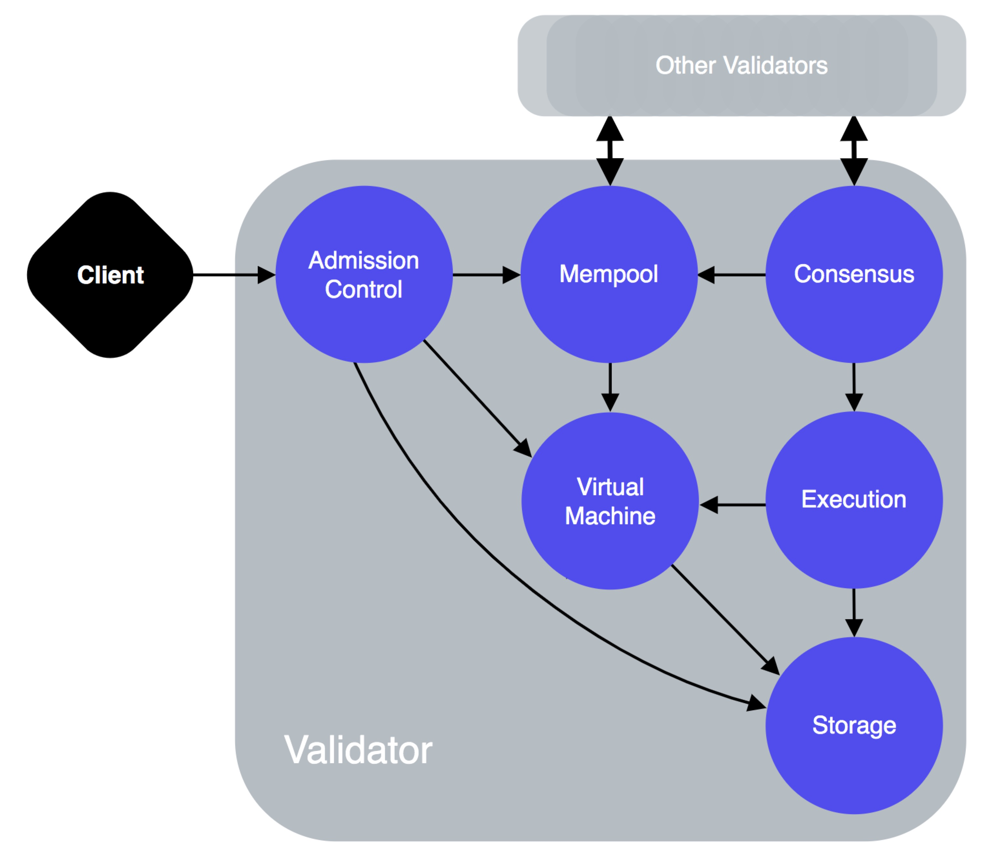

# Libra协议：重要概念

原文链接：[https://developers.libra.org/docs/libra-protocol](https://developers.libra.org/docs/libra-protocol) 译者：humyna 日期：2019.07.13 版权及转载声明：本作品采用[知识共享署名-非商业性使用-禁止演绎 4.0 国际许可协议](https://creativecommons.org/licenses/by-nc-nd/4.0/)进行许可。

Libra区块链是一个基于Libra协议，加密认证的分布式数据库。本文档简要描述了Libra协议中的关键概念。Libra协议中所有元素的详细说明，请参考[Libra区块链技术白皮书](https://libra.org/en-US/white-paper/)。 
 Libra区块链由多个验证节点组成的分布式网络来维护，也可以称为验证器。验证节点通过遵守共识协议来保证区块链中的交易顺序达成一致。 
 Libra 测试网络（testnet）是Libra区块链软件(Libra Core)的早期原型的演示。 

## 交易和状态
Libra协议的核心是两个基本概念 — 交易和状态。 在任意时刻，区块链都有一个“状态”。状态（或称为账本状态）表示链上数据的当前快照。 执行交易后会改变区块链的状态。 
  图1.1交易改变状态 
 图1.1表示在Libra区块链上执行交易时状态的变化。例：在状态 S 时，Alice拥有 110 Libra 币，Bob拥有52个Libra 币。当交易（T）发生后，区块链生成一个新的状态。为了从状态从S过渡到S ，需要交易 T应用于状态S。这导致Alice的余额减少10个 Libra 币，Bob的账户增加 10个Libra 币。新的状态（S）显示更新后的Libra 币余额，在图1.1中：

- **A** 和 **B** 表示区块链中的Alice和Bob的帐户。
- **S** 表示区块链中第 N-1 个的状态。
- **T**表示在区块链上执行的第 N 个交易
  - 在例子是，T意思是“从Alice的账户发送10个Libra 币到Bob的账户”
- **F** 一个确定性函数。F函数对于确定初始状态在执行特定交易后始终会返回一个相同的的最终状态。如果区块链当前状态是S，那么在状态S上执行了交易T，最后区块链的状态一定是S。
- **S** 是区块链的第N个状态。 S是应用函数F处理T与S 后的结果。

Libra协议使用 Move 语言 来实现函数F的确定性执行。

### 交易
Libra 区块链的客户端通过提交交易来请求更新账本的状态，在区块链上一个签名交易包含： 

- **发送人地址** — 交易发起人的帐户地址。译者:humyna
- **发送人的公钥** — 用于签名交易的私钥对应的公钥。
- **程序**— 程序包括以下内容:
  - Move字节码交易脚本。
  - 可选的输入参数列表。对于点对点的交易中，输入包含接收人的信息和发送给接收人的金额。
  - 可选的需发布的字节码模块
- **Gas 价格** (以 microlibra/gas 为单位) — 发送方执行交易时需要为每单位gas支付的价格。 Gas是在区块链上计算和存储费用的一种方式。Gas是一个计算量的抽象，没有固定的真实价值。
- **Gas 上限** — 交易允许消耗的最大 Gas 量。
- **序列数** — 无符号整型，必须等于发送方帐户中存储的序列号。
- **过期时间** — 交易有效截止的时间。
- **签名** — 发送方的数字签名。

 交易脚本是一个任意的程序，用于对交易逻辑进行编码，并与Libra区块链中发布的资源进行交互。

### 账本状态
账本或者称为Libra区块链的全局状态，它是由区块链中所有账户状态组成的。在执行交易时，每个验证节点必须知道区块链中的分布式数据库的最新版本的全局状态。 参考[版本化数据库](#uoFGD)。

## 版本数据库
Libra区块链中的所有数据都保存在单个版本化分布式数据库中。版本号是一个无符号的 64 位整数，与系统已执行的交易数相对应。 
 版本数据库（versioned database）允许验证器: 

- 在最新版本状态下执行交易。
- 响应客户端当前和以前版本的账本的历史记录数据查询译者:humyna

## 账户
Libra账户包含 Move 模块和Move 资源。它通过账户地址来标识。这本质上意味着每个账户的状态都包含代码和数据： 

- **Move 模块** 包含代码（类型和过程声明），但他们不包含数据。模块过程编码更新区块链全局状态的规则。
- **Move 资源** 包含数据不包含代码。每个资源值都有一个发布在区块链分布式数据库的模块中声明过的类型。译者:humyna

账户可以包含任意数量的Move资源和Move模块。 **账户地址** Libra账户的地址是256位的值。用户使用数字签名来声明地址。账户的地址是用户公钥的加密Hash。用户（或者托管账户代表用户）必须通过账户相关的私钥签名才能发出交易。 
 Libra用户申请的地址数量是没有限制的，不过要想申请一个地址需要从一个有足够LIbra币的账户支付一笔创建账号的费用。

## 证明
Libra区块链的所有数据都存储在单一版本的分布式数据库中。存储是用于记录商定的区块交易及执行结果。区块链用一个不断增长的交易集的Merkle树来表示。区块链上执行的每个交易，都会有"叶子"被附加到Merkle树上。 

- 证明是一种验证Libra区块链中数据真实性的方式。
- 区块链上存储的每个操作都可以进行加密验证,因此,由此得出的证明也证明没有任何数据被遗漏。例如,如果客户端查询某个帐户最新的 _n_ 个交易，证明会验证查询响应中未遗漏 任何交易。

在区块链中,客户端不需要信任从中接收数据的实体。客户端可以查询帐户的余额，询问一笔特定交易是否被处理了，等等。与其他的Merkle 树一样, 账本历史可以对一个特定的交易提供 O(log n)时间复杂度的证明，_n_ 是已处理的总交易量。

## 验证器节点(验证器)
Libra 区块链的客户创建交易并将其提交到验证器节点。验证器节点运行共识协议(与其他验证器节点一起)，执行交易，并将交易和执行结果存储到区块链中。验证器节点决定哪些交易以及这些交易按照什么顺序被添加到区块链中。译者:humyna 
  图 1.2 验证器的逻辑组件 
 一个验证器节点包含以下逻辑组件: 
 **准入控制 (AC)**

- 准入控制是验证器节点的唯一外部接口。客户端对验证器节点发出的任何请求首先转到AC组件。
- AC对请求执行初始检查,以保护验证器节点的其他部分免受损坏或大量输入的影响。

 **内存池**

- 内存池是一个缓存区，用于保存"等待"执行的交易。
- 当一笔新交易被添加到验证器节点的内存池，这个验证器节点的内存池与系统中其他验证器的内存池共享这笔交易。译者:humyna

 **共识 **

- 共识组件负责对交易区块进行排序，并与网络中的其他验证器节点在共识协议下商定执行结果。

 **执行 **

- 执行组件利用虚拟机 (VM) 执行交易。
- 执行的工作是协调交易块的执行,并保持一个可以被共识投票的瞬时状态。
- 执行组件会维护执行结果的内存表示,直到共识将块提交到分布式数据库。

 **虚拟机（VM）**

- AC 和 内存池 使用 VM 组件对交易执行验证检查。
- VM 用于运行交易中包含的程序并确定结果。

 **存储 Storage** 存储用于保存已经商定过的交易块及其执行结果。 
 有关每个验证器组件与其他组件的交互信息，参考[交易生命周期](https://developers.libra.org/docs/life-of-a-transaction)

## 参考

- [欢迎页](https://www.yuque.com/dkkomb/zn2x7l/btktyh)
- [我的第一笔交易 ](https://developers.libra.org/docs/my-first-transaction)— 指导你使用Libra CLI客户端在Libra区块链上执行你的第一笔交易。
- [开始使用Move ](https://developers.libra.org/docs/move-overview)— 介绍新区块链编程语言Move。
- [交易的生命周期](https://developers.libra.org/docs/life-of-a-transaction) — 介绍交易被提交和执行的底层实现
- [Libra Core 概述](https://developers.libra.org/docs/libra-core-overview) — Libra Core 组件的概念和实现细节。
- [CLI 指南](https://developers.libra.org/docs/reference/libra-cli) — 列出了Libra CLI客户端的命令及其用法。
- [Libra 词汇表](https://developers.libra.org/docs/reference/glossary) — 提供了一份Libra技术的快速参考。
