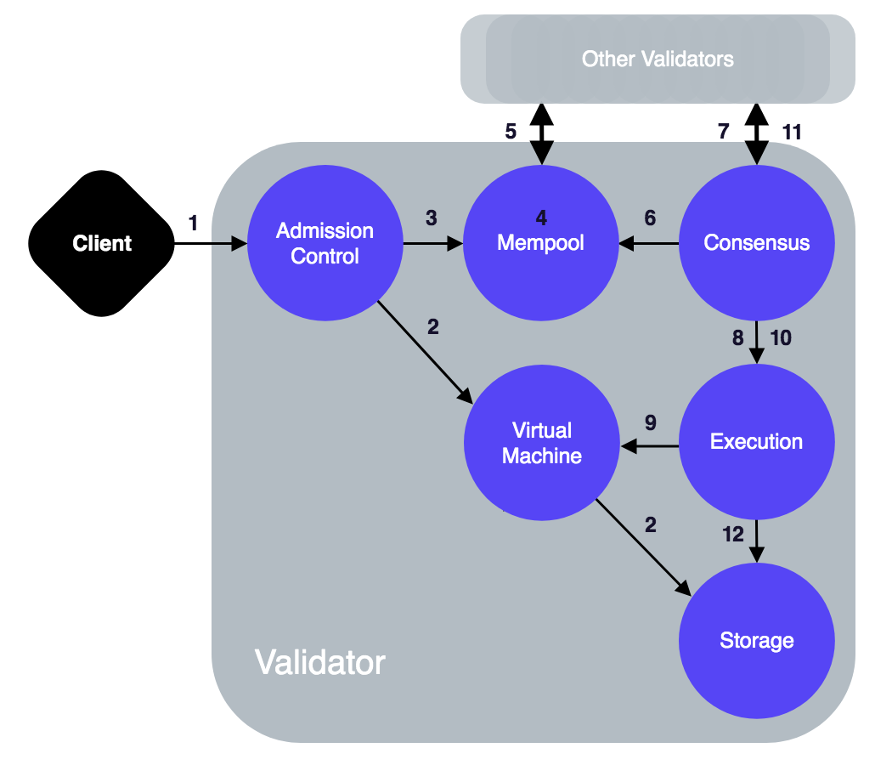
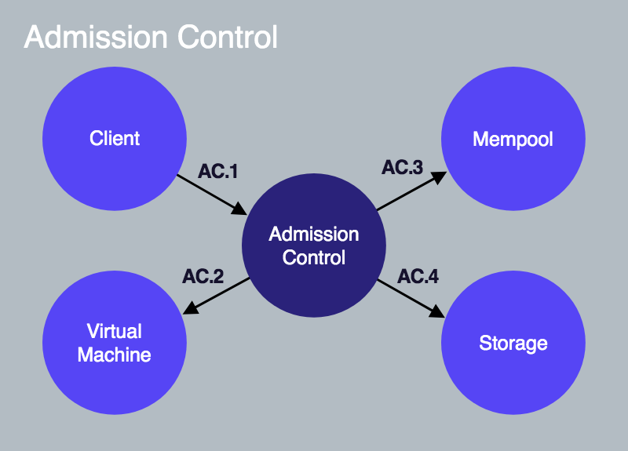
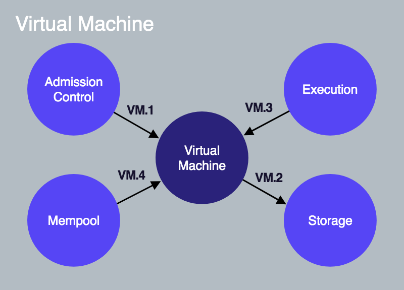
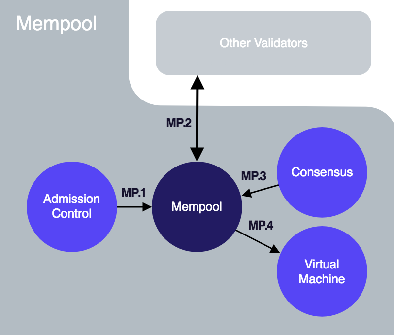
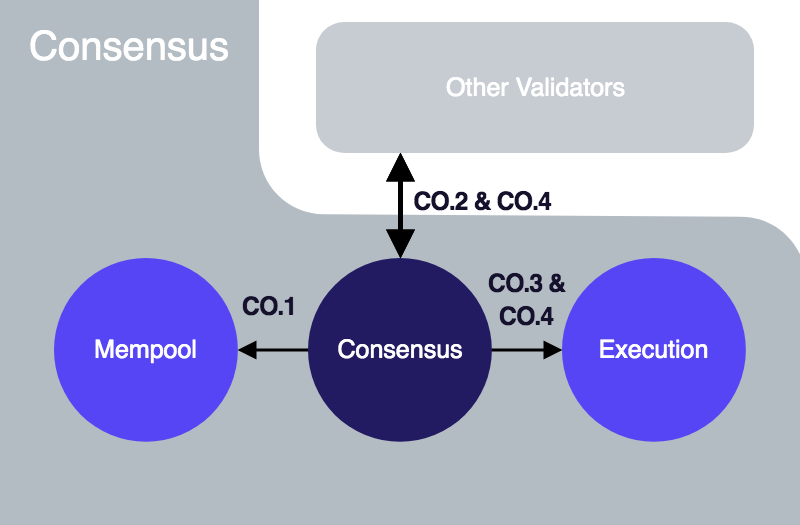
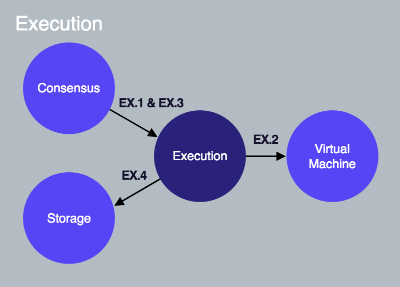
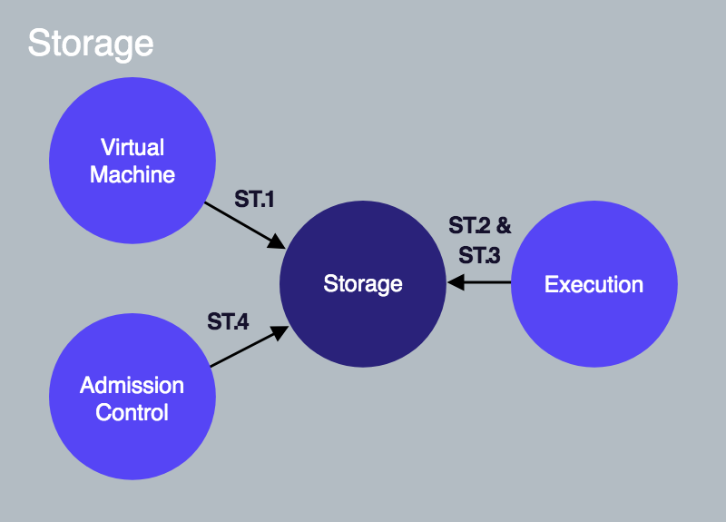

# 交易的生命周期

原文链接：[https://developers.libra.org/docs/life-of-a-transaction](https://developers.libra.org/docs/life-of-a-transaction) 译者：humyna 日期：2019.07.17 版权及转载声明：本作品采用[知识共享署名-非商业性使用-禁止演绎 4.0 国际许可协议](https://creativecommons.org/licenses/by-nc-nd/4.0/)进行许可。

为了更深入的了解Libra交易的生命周期，我们将跟踪一笔交易，从提交到Libra验证器到在Libra区块链上确认交易的整个过程。然后，我们将“放大”验证器中每个逻辑组件，并查看与其他组件之间的交互。 

## 客户端提交交易

由Libra 客户端构造一个**原始交易**（称之为Traw）：将10个Libra 币从 Alice 账户转移到 Bob 的账户。原始交易包含以下字段。每个字段都和词汇表定义加上了超链接关联。 

- Alice的[账户地址](https://developers.libra.org/docs/reference/glossary#account-address).
- 一段表示 Alice 执行的操作的程序，包含如下:
  - 一段Move字节码[点对点交易脚本](https://developers.libra.org/docs/reference/glossary#transaction-script).
  - 脚本输入参数列表 (例如，Bob的帐户地址和支付金额).
- [Gas价格](https://developers.libra.org/docs/reference/glossary#gas-price) (以 microlibra/gas 为单位) — Alice账户执行交易时需要支付的每单位的gas。 Gas是支付计算和储存费用的一种方式。一个Gas单位是一种没有固有的实际值的抽象的计算度量。
- Alice愿意为此次交易支付的[最大Gas量](https://developers.libra.org/docs/reference/glossary#maximum-gas-amount) 。
- 交易的[到期时间](https://developers.libra.org/docs/reference/glossary#expiration-time) 。
- [序列号](https://developers.libra.org/docs/reference/glossary#sequence-number)— 5
  - 序列号为5的交易只有只能应用在序列号为5的账户上。

客户端使用Alice的私钥签名交易Traw。签名后的交易T5包括以下内容： 

- 原始交易。
- Alice的公钥
- Alice的签名

### 假设

为了描述交易 T 的生命周期，我们假设： 

- Alice和Bob在Libra区块链上有[账户](https://developers.libra.org/docs/reference/glossary#accounts) .
- Alice的账户中有110个 Libra 币。
- Alice的帐户当前[序列号](https://developers.libra.org/docs/reference/glossary#sequence-number) 是5（表示已经从Alice的帐户发送了5个交易）。
- 网络上共有100个验证器 —  V 到 V 。
- 客户端将交易 T 提交给验证器 V
- **验证器 V 是本次的提议者/领导者。**

## 交易的生命周期

在本节中，我们将描述交易T的生命周期，从被客户端提交到在Libra区块链上被确认。

遵循生命周期中的步骤编号，我们提供了验证器节点中内部交互组件相应的链接。熟悉了交易的生命周期中所有的步骤后，你可能会参考每步相应内部交互组件的信息。 

> **注意:** 文档中所有图形中的箭头源自启动一个交互/动作的组件，终止于被正在执行动作的组件。 箭头不**表示数据**读取，写入或返回。

 图1.1 一个交易的生命周期 

### 接受交易

**1** — 客户端将交易 T 提交给验证器 V ，验证器V1的准入控制（AC）组件接收该交易。 (客户端 → AC [AC.1](https://developers.libra.org/docs/life-of-a-transaction#client-ac-ac1)) **2** — AC将使用虚拟机（VM）组件执行验证检查，例如签名验证，检查Alice的帐户是否有足够的余额，检查交易 T 是否未被重复广播等。(AC → 虚拟机 [AC.2](https://developers.libra.org/docs/life-of-a-transaction#ac-vm-ac2), [VM.1](https://developers.libra.org/docs/life-of-a-transaction#ac-vm-vm1)) **3** — 当 T 通过验证检查，AC将 T 发送到V的内存池。(AC → 存池 [AC.3](https://developers.libra.org/docs/life-of-a-transaction#ac-mempool-ac3), [MP.1](https://developers.libra.org/docs/life-of-a-transaction#ac-mempool-mp1)) 

### 共享交易至其他验证节点

**4** — 内存池将 T 保存在内存缓冲区中。 内存池可能已包含多个从Alice的地址发送的交易。 **5** — 使用共享内存池协议，V 将共享其内存池中的所有交易（包括T）给其他验证器（V2到V100）广播交易，并将从其他验证器接收的交易放入自己的内存池中。(内存池 → 其他验证器 [MP.2](https://developers.libra.org/docs/life-of-a-transaction#mempool-other-validators-mp2))

### 提议区块

**6** — 由于验证器 V 是提议者/领导者，它将从其内存池中取出一组交易，并通过共识组件将该交易块作为提议复制到其他验证器。(共识 → 内存池 [MP.3](https://developers.libra.org/docs/life-of-a-transaction#consensus-mempool-mp3), [CO.1](https://developers.libra.org/docs/life-of-a-transaction#consensus-mempool-co1)) **7** — V 的共识组件负责在所有验证器之间协调提议块中交易的顺序。 (共识 → 其他验证者 [CO.2](https://developers.libra.org/docs/life-of-a-transaction#consensus-other-validators-co2))。 对于我们提出的共识协议LibraBFT的详细信息，请参考我们[Libra区块链中的状态机复制](https://developers.libra.org/docs/state-machine-replication-paper) 的技术论文。 

### 执行区块和达成共识

**8** — 作为达成协议的一部分，交易块（包含 T ）被传递给执行组件。 (共识 → 执行 [CO.3](https://developers.libra.org/docs/life-of-a-transaction#consensus-execution-consensus-other-validators-co3), [EX.1](https://developers.libra.org/docs/life-of-a-transaction#consensus-execution-ex1)) **9** — 执行组件管理交易在虚拟机（VM）中的执行。 请注意，在块中的交易已经达成一致之前，这个执行试探着发生的。 (执行 → VM [EX.2](https://developers.libra.org/docs/life-of-a-transaction#execution-vm-ex2), [VM.3](https://developers.libra.org/docs/life-of-a-transaction#execution-vm-vm3)) **10** — 在执行块中的交易之后，执行组件将块中的交易（包括 T ）附加到[Merkle累加器](https://developers.libra.org/docs/life-of-a-transaction#merkle-accumulators)（账本历史）。这是Merkle累加器的内存/临时版本。 执行这些交易（已提议/试探性）的结果会返回到共识组件。 (共识 → 执行 [CO.3](https://developers.libra.org/docs/life-of-a-transaction#consensus-execution-consensus-other-validators-co3), [EX.1](https://developers.libra.org/docs/life-of-a-transaction#consensus-execution-ex1)). 从“共识”到“执行”的箭头表示执行交易的请求是由共识组件发出的。 （为了使箭头在整个文档中的使用含义一致，我们不使用箭头表示数据流）。 **11** — V（共识领导者）试图与参与共识的其他验证者就该块的执行结果达成共识。 (共识 → 其他验证者 [CO.3](https://developers.libra.org/docs/life-of-a-transaction#consensus-execution-consensus-other-validators-co3)) 

### 提交区块

**12** — 如果块的执行结果是由一组拥有多数投票权的验证器商定和签署的，则验证器  V 的执行组件从试探执行缓存中读取块执行的结果并提交块中的所有交易至持久存储中。 (共识 → 执行 [CO.4](https://developers.libra.org/docs/life-of-a-transaction#consensus-execution-co4), [EX.3](https://developers.libra.org/docs/life-of-a-transaction#consensus-execution-ex3)), (执行 → 存储 [EX.4](https://developers.libra.org/docs/life-of-a-transaction#execution-storage-ex4), [ST.3](https://developers.libra.org/docs/life-of-a-transaction#execution-storage-st3)) **13** — Alice的账号现在有100个Libra 币，它的序列号将变成6. 如果Bob重新提交T，由于Alice的账号（6）的序列号大于重放的交易的序列号（5），它将被拒绝。【译者注：此处为防止重放攻击的实现原理】 

## 验证器组件交互

在[上一节](https://developers.libra.org/docs/life-of-a-transaction#lifecycle-of-the-transaction)，我们描述了一个简单交易从提交到在区块链分布式数据库中确认的典型生命周期。现在让我们更深入地了解当验证器如何处理交易和响应查询时，验证器组件间的交互。这些信息对这些人员更有用: 

- 想要全面了解系统底层是如何工作的。
- 有兴趣为Libra Core软件做出贡献。

为了叙述方便，我们假设客户端将交易 T 提交给验证器 V。 对于每个验证器组件，我们将在各个组件的小节下的分段中描述各个组件间的交互。 请注意，描述组件间交互的分段未严格按其执行顺序列出。 大多数交互与交易的处理相关，少数与客户端读取查询相关（查询区块链上的已有信息）。

让我们看一下验证器节点的核心逻辑组件: 

- [准入控制](https://developers.libra.org/docs/life-of-a-transaction#admission-control-ac)
- [内存池](https://developers.libra.org/docs/life-of-a-transaction#mempool)
- [共识](https://developers.libra.org/docs/life-of-a-transaction#consensus)
- [执行](https://developers.libra.org/docs/life-of-a-transaction#execution)
- [虚拟机](https://developers.libra.org/docs/life-of-a-transaction#virtual-machine-vm)
- [存储](https://developers.libra.org/docs/life-of-a-transaction#storage)

在每个部分的结尾，我们提供了[Libra Core](https://developers.libra.org/docs/libra-core-overview) 中相应的链接。 

## 准入控制(AC)
 图 1.2 准入控制 
  准入控制组件是验证器的_唯一外部接口_。 客户端向验证器发出的任何请求会先达到AC。

### 客户端 → AC(AC.1)
客户端将交易 V 提交给验证器的准入控制组件。 这通过 `AC::SubmitTransaction()` 来完成。

### AC → 虚拟机(AC.2)
准入控制访问验证器的虚拟机（VM）并对交易初步检查，以便尽早拒绝格式错误的交易。 这通过[VM::ValidateTransaction()](https://developers.libra.org/docs/life-of-a-transaction#virtual-machine-b) 来完成 。 

### AC → 内存池(AC.3)
一旦 `VM::ValidateTransaction()` 没有返回错误, AC通过 `Mempool::AddTransactionWithValidation().` 将交易转发到验证器 V 的内存池。 只有当 T 的序列号大于或等于发送者帐户的当前序列号时，验证器 V 的内存池才会接受来自AC的交易 T （请注意，直到交易序列号是下一个序列号，才算达成共识）

### AC → 存储(AC.4)
当客户端对Libra区块链执行查询时（例如，为了获得Alice帐户的余额），AC与存储组件直接交互获取所请求的信息

### 准入控制文档
有关实现细节，请参考[准入控制文档](https://developers.libra.org/docs/crates/admission-control). 

## 虚拟机(VM)
 图 1.3 虚拟机

[Move 虚拟机](https://developers.libra.org/docs/move-overview) (VM) 验证并执行由Move字节码编写的交易脚本。 

### AC → 虚拟机(VM.1)
当验证器 V 的准入控制模块从客户端接收到交易时，它会调用VM上的 `VM::ValidateTransaction()` 来验证交易。

### 虚拟机 → 存储(VM.2)
当AC或内存池通过 `VM::ValidateTransaction()` 请求虚拟机验证交易时，虚拟机从存储加载交易发送者的帐户并执行以下验证： 

- 检查签名交易中的输入签名是否正确（拒绝错误签名的交易）
- 检查发送人的帐户身份验证key是否与其公钥的哈希相同（对应签署交易的私钥）。
- 验证交易的序列号是否不小于发件人帐户的当前序列号。 执行此检查可防止针对发件人帐户相同交易的重放攻击。
- 验证签名交易中的程序代码有没有错误，因为虚拟机无法执行错误的程序代码。
- 验证发件人帐户中是否有足够的余额来支付指定交易的最大Gas量，从而确保交易可以支付资源使用费。

### 执行 → 虚拟机(VM.3)
执行组件通过调用虚拟机的 `VM::ExecuteTransaction()` 执行交易。 
 理解执行一笔交易不同于更新账本的状态和将执行结果保存在存储是非常重要的。 交易 T 作为在共识期间尝试达成一致的一部分先执行。 如果与其他验证节点就交易顺序及其执行结果达成了一致，那么结果就将保留在存储中，账本的状态也被更新。

### 内存池 → 虚拟机(VM.4)
当内存池通过共享的内存池从其他验证器接收一笔交易时，内存池会在虚拟机上调用 `VM::ValidateTransaction()`来验证交易。

### 虚拟机文档
详细的实现细节参考[虚拟机文档](https://developers.libra.org/docs/crates/vmhttps://developers.libra.org/docs/crates/vm). 

## 内存池
 图 1.4 内存池 

内存池是一个共享缓冲区，用于保存“等待”执行的交易。 当一个新交易被添加到内存池时，内存池将与系统中的其他验证器共享此交易。 为了减少“共享内存池”中的网络消耗，每个验证器负责将其自己的交易传递给其他验证器。 当一个验证器从另一个验证器的内存池接收到一个交易时，该交易将被添加到接收者验证器的内存池中。  

### AC → 内存池(MP.1)

- 执行初始验证检查后，验证器的AC将交易发送到验证器的内存池。
- 仅当 T 的序列号大于或等于发件人帐户的当前序列号时，验证器 V 中的内存池才接收发送人帐户的交易 T 。
- 验证器 V 的内存池与同一网络中的其他验证器共享交易 T 。
- 其他验证器与验证器 V 共享它们内存池中的交易。

### 共识 → 内存池(MP.3)

- 当验证器 V 成为领导者时，其共识模块将从其内存池中提取一个交易块并将该块复制给其他验证器。 这样做的目的是为了将交易的排序和块中交易的执行结果达成共识。
- 注意，因为交易 T 包含在共识块中，它不能保证 T 最终会存储在区块链的分布式数据库中永久存储。

### 内存池文档
详细的实现细节参考[内存池文档](https://developers.libra.org/docs/crates/mempool).

## 共识
 图 1.5 共识组件

共识组件负责处理排序交易块，并与网络中参与共识协议的其他验证器一起商定执行结果。 

### 共识 → 内存池(CO.1)
当验证器 V 是领导者/提议者时，验证器 V 的共识通过 `Mempool::GetBlock()` 从其内存池中提取一个交易块，产生提议。

### 共识 → 其他验证器(CO.2)
如果 V 是提议者/领导者，则其共识组件将提取的交易块复制给其他验证器。

### 共识 → 执行, 共识 → 其他验证器(CO.3)

- 为了一个交易块得到执行，共识与执行组件进行交互。 通过调用执行组件 `Execution:ExecuteBlock()` 来执行交易 (参考 [共识 → 执行](https://developers.libra.org/docs/life-of-a-transaction#consensus-execution-ex1))
- 在执行完块中的所有交易之后，执行组件返回这些交易的执行结果给共识组件。
- 共识签署执行后的结果，并尝试与参与共识的其他验证节点就此结果达成一致。
-  

### 共识 → 执行(CO.4)
如果网络中有足够的验证器为同一执行结果投票，则验证器 V 的共识组件通过 `Execution::CommitBlock()`来通知执行组件该交易块已准备好被提交。

### 共识文档
详细的实现细节参考[共识文档](https://developers.libra.org/docs/crates/consensushttps://developers.libra.org/docs/crates/consensus). 

## 执行
 图 1.6 执行

执行组件的工作是协调交易区块，并维持一个可以通过共识投票的过渡状态。 

### 共识 → 执行(EX.1)

- 共识组件通过 `Execution::ExecuteBlock()` 来请求执行组件执行交易块。
- 执行组件维护一个“暂存器”，它将保存[Merkle累加器](https://developers.libra.org/docs/life-of-a-transaction#merkle-accumulators)中相关部分的内存副本。 信息用于计算区块链当前状态的根哈希值。
- 当前状态的根哈希与块中交易的信息组合以确定Merkle累加器的新根哈希值。 这一步在持久化任何数据之前就执行了，为了确保在法定数量的验证者达成协议之前不会存储任何状态或交易。
- 执行组件计算推测根哈希值，然后验证器 V 的共识签署此根哈希值，并尝试与其他验证器对此根哈希值达成一致。

### 执行 → 虚拟机(EX.2)
当共识请求执行组件使用`Execution::ExecuteBlock()` 执行交易块时，执行组件使用虚拟机来确定执行交易块的结果。

### 共识 → 执行(EX.3)
如果法定数量的验证器商定区块的执行结果，那么每个验证器调用其执行组件的 `Execution::CommitBlock()` 表示区块已准备被提交。 这次执行组件的调用会包含商定的验证器的签名来提供它们商定的证明。

### 共识 → 存储(EX.4)
执行组件从其“暂存器”获取值，并通过 `Storage::SaveTransactions()` 将它们发送到存储器进行持久化。 执行删除 “暂存器” 中不再需要的旧值（例如，无法被提交的平行块）。

### 执行文档
详细的实现细节参考[执行文档](https://developers.libra.org/docs/crates/execution). 

## 存储
 图 1.7 存储

存储组件保存共识执行后的交易块及其执行结果。 在以下情况下，一个/一组块的交易（包括交易 T ）将通过存储组件保存：

- 超过 2f+1参与共识的验证者就以下所有情况达成共识：
  - 在块中包含哪些交易。
  - 交易的排序。
  - 包含在块中的交易的执行结果。

有关如何将交易附加到区块链的数据结构的信息，请参考[Merkle累加器](https://developers.libra.org/docs/reference/glossary#merkle-accumulators) 。

### 虚拟机 → 存储(ST.1)
当AC或内存池调用`VM::ValidateTransaction()`来验证交易时，`VM::ValidateTransaction()`从存储中加载发送人的帐户，并对交易执行只读有效性检查。

### 执行 → 存储(ST.2)
当共识组件调用 `Execution::ExecuteBlock()` 时，执行组件从存储中读取当前状态并结合内存中的“暂存器”数据来确定执行结果。

### 执行 → 存储(ST.3)

- 一旦达成了对交易块的共识，执行组件就会通过调用 `Storage::SaveTransactions()`来保存交易块并永久记录它们，同时存储网络中同意该交易块的验证器节点的数字签名。
- 该块中“暂存器”的内存数据将更新到存储中，并保存交易。
- 当存储被更新时，所有被每笔交易修改过的资源的序列号都会相应被更新。
- 注意：帐户的每一次交易确认，Libra区块链上该帐户的序列号都会增加1。

### AC → 存储(ST.4)
客户端查询区块链中的信息，AC直接与存储组件交互以读取所请求的信息。 

### 存储文档
详细的实现细节参考[存储文档](https://developers.libra.org/docs/crates/storage). 

## 参考

- [欢迎页](https://www.yuque.com/dkkomb/zn2x7l/btktyh)
- [Libra 协议核心概念](https://www.yuque.com/dkkomb/zn2x7l/egc84k) — 介绍Libra 协议的核心概念
- [我的第一笔交易 ](https://developers.libra.org/docs/my-first-transaction)— 指导你使用Libra CLI客户端在Libra区块链上执行你的第一笔交易。
- [开始使用Move ](https://developers.libra.org/docs/move-overview)— 介绍新区块链编程语言Move。
- [Libra Core 概述](https://developers.libra.org/docs/libra-core-overview) — Libra Core 组件的概念和实现细节。
- [CLI 指南](https://developers.libra.org/docs/reference/libra-cli) — 列出了Libra CLI客户端的命令及其用法。
- [Libra 词汇表](https://developers.libra.org/docs/reference/glossary) — 提供了一份Libra技术的快速参考。
- [Libra区块链中的状态机复制](https://developers.libra.org/docs/state-machine-replication-paper) — 详细介绍我们的共识协议**LibraBFT**。
