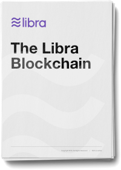

# Libra区块链

原文链接：[https://developers.libra.org/docs/the-libra-blockchain-paper](https://developers.libra.org/docs/the-libra-blockchain-paper) 译者：humyna 日期：2019.07.22 版权及转载声明：本作品采用[知识共享署名-非商业性使用-禁止演绎 4.0 国际许可协议](https://creativecommons.org/licenses/by-nc-nd/4.0/)进行许可。

## 摘要
Libra区块链是一个去中心化、可编程的数据库，用于支持一个具有为全世界数十亿人提供有效互换媒介能力的低波动性的加密数字货币。我们提出了一项关于Libra协议的提案，它实现了Libra区块链，目标是创建一个可促进创新、降低进入和访问金融服务的壁垒的金融基础设施。为了验证Libra协议的设计，我们已经构建了一个开源原型实现 —— Libra Core ，期待全球合作努力推进这一新生态系统。

Libra协议允许来自不同机构的一组副本（称为验证者）共同维护一个可编程资源的数据库。这些资源由经过公钥加密验证的不同用户帐户所拥有，且遵守这些资源开发者制定的自定义规则。验证者处理交易并相互交互，就数据库的状态达成共识。交易是基于预定义的和新编程语言Move实现的用户定义的智能合约(在未来的版本中)。

我们使用Move语言定义区块链的核心机制，例如货币和验证者成员。这些核心机制能够创建一个独特的治理机制，该机制早期建立在稳定、有信誉的机构基础之上，但随着时间的推移过渡到一个完全开放的系统。 

### 下载

