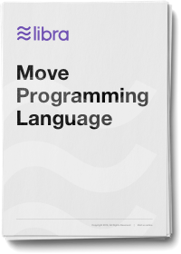

# Move：可编程资源的语言

原文链接：[https://developers.libra.org/docs/move-paper](https://developers.libra.org/docs/move-paper) 译者：humyna 日期：2019.07.22 版权及转载声明：本作品采用[知识共享署名-非商业性使用-禁止演绎 4.0 国际许可协议](https://creativecommons.org/licenses/by-nc-nd/4.0/)进行许可。

## 摘要
我们为Libra 区块链提出了一种安全灵活的编程语言Move。 Move是一种可执行的字节码语言，用于实现自定义交易和智能合约。 Move的关键特性是能够定义具有受线性逻辑启发的语义的自定义资源类型：资源永远不会被复制或隐式丢弃，只能在程序存储位置之间移动。这些安全保证由Move的静态类型系统强制执行。尽管这些特殊保护，资源仍只是普通的程序值——可以存储在数据结构中，作为参数传递给程序，等等。 “第一类资源”是一个非常普遍的概念，程序员不仅可以使用它来实现安全的数字资产，还可以编写正确的业务逻辑来包装资产和实施访问控制策略。 Move语言的的安全性和表现力，使我们能使用Move实现Libra协议的重要部分，包括Libra币，交易处理和验证器管理。

### 下载

