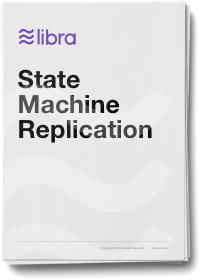

# Libra区块链的状态机复制

原文链接：[https://developers.libra.org/docs/state-machine-replication-paper](https://developers.libra.org/docs/state-machine-replication-paper) 
译者：humyna 
日期：2019.07.22 
更新日期:2020.02.22 
版权及转载声明：本作品采用[知识共享署名-非商业性使用-禁止演绎 4.0 国际许可协议](https://creativecommons.org/licenses/by-nc-nd/4.0/)进行许可。

## 摘要
本报告描述了LibraBFT的算法核心LBFT，并讨论了其生产的下一步工作。共识协议负责对交易进行排序并完成它。LBFT在一组动态可重新配置的验证器之间分散信任，并保持了网络不同步时的安全，即使在任何特定的配置时期，参与者的阈值也是拜占庭式的。

LBFT基于一个新协议HotStuff，HotStuff协议利用了拜占庭容错（BFT）几十年来的科学进步，实现了Internet环境所要求的强大的可伸缩性和安全性。 LBFT和HotStuff的不同之处在于它的一些新颖功能。LBFT包含了一种新颖的回合同步机制，该机制提供了同步下的有限提交延迟。它引入了一个零块投票，其允许尽管有错误的领导者仍然提交提案。它将参与者的正确行为封装在一个可分离的信任区模块中，允许它在一个安全的硬件飞地中运行，从而减少了参与者的攻击面。

LBFT可以通过在序列中嵌入配置更改命令来重新配置自身。一个新的配置时期可能会改变从验证程序集到协议本身的所有内容。

### 下载

