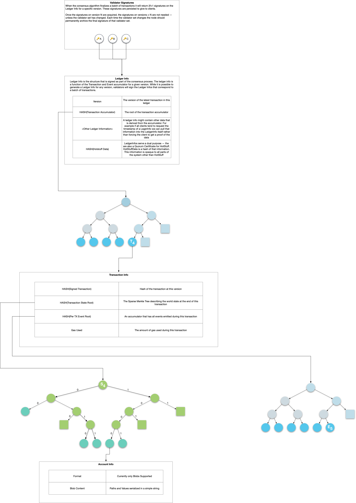

# 存储

原文链接：[https://developers.libra.org/docs/crates/storage](https://developers.libra.org/docs/crates/storage)<br/>
译者：humyna<br/>
日期：2019.09.27<br/>
版权及转载声明：本文采用[知识共享署名-非商业性使用-禁止演绎 4.0 国际许可协议](https://creativecommons.org/licenses/by-nc-nd/4.0/)进行许可。<br/>

存储模块为Libra区块链上的所有数据集和Libra Core内部使用的必要数据提供可靠和高效的持久存储。

## 概述

存储模块设计用于两个主要目的：


1. 保留区块链数据，特别是被验证方通过共识协议达成一致的交易及其输出。
1. 为任何区块链部分数据的查询提供一个带有Merkle证明的响应。如果客户端获得了正确的根散列值(root hash)，则可以轻松地验证响应的完整性。


Libra 区块链可以被视为包含以下组件的Merkle树：


### 账本历史

账本历史由Merkle累加器表示。 每次将交易 `T` 添加到区块链时, 一个包含交易 `T` 的 _TransactionInfo_ 结构、执行 `T` 后状态Merkle树的root hash和通过 `T` 生成的事件Merkle树的root hash 被附加到累加器。

### 账本状态

每个版本的账本状态由包含所有帐户状态的稀疏Merkle树表示。 密钥是地址的256位散列值，它们的对应值是序列化为二进制大对象(blob)的整个帐户的状态。 虽然大小为 `2^256` 的树是一个难以处理的表示方式，但完全由空节点组成的子树将替换为占位符值，而由完全由一个叶子组成的子树将替换为单个节点。

然而每个 _TransactionInfo_ 结构指向不同的状态树，但新树可以重用前一树的未更改部分，从而形成持久数据结构。

### 事件

每个交易发出一个事件列表，这些事件构成一个Merkle累加器。与状态Merkle树类似，交易的事件累加器的root hash记录在相应的 _TransactionInfo_ 模块。

### 账本信息和签名

_LedgerInfo_ 结构包含在某个版本历史账本历史累计器的根散列(root hash)和其他元数据，它是该版本之前的账本历史的绑定承诺。验证器每次就一组交易及其执行结果达成一致时，都要签署相应的 _LedgerInfo_ 结构。因为每个 _LedgerInfo_ 结构被存储，还有来自验证器对于该结构一组签名也被存储了，所以客户端在获得每个验证器的公钥后可就能以验证该 结构。

## 实现细节

存储模块使用 [RocksDB](https://rocksdb.org/) 作为其物理存储引擎。 由于存储模块需要存储多种类型的数据，而RocksDB中的键值对是字节数组，因此在RocksDB上有一个包装器来处理键和值的序列化。 此包装器强制所有进出数据库的数据都是根据预定义的模式构造的。

实现主要功能的核心模块被称为 _LibraDB_. 我们使用单个RocksDB实例来存储整个数据集，相关的数据被分组到逻辑存储中 — 例如，账本存储，状态存储和交易存储等。

对于表示账本状态的稀疏Merkle树，我们使用具有16个子节点（表示4级子树）的分支节点和表示无分支路径的扩展节点来优化磁盘布局。 但是，在计算根散列值(root hash)和证明时，我们仍然会模拟一个二叉树。 此修改导致证明比以太坊的Merkle Patricia树生成的证明更短。

## 代码结构

```
storage
          └── accumulator      # Implementation of Merkle accumulator.
          └── libradb          # Implementation of LibraDB.
          └── schemadb         # Schematized wrapper on top of RocksDB.
          └── scratchpad       # In-memory representation of Libra core data structures used by execution.
          └── jellyfish_merkle # Implementation of sparse Merkle tree.
          └── state_view       # An abstraction layer representing a snapshot of state where the Move VM reads data.
          └── storage_client   # A Rust wrapper on top of GRPC clients.
          └── storage_proto    # All interfaces provided by the storage module.
          └── storage_service  # Storage module as a GRPC service.
```

